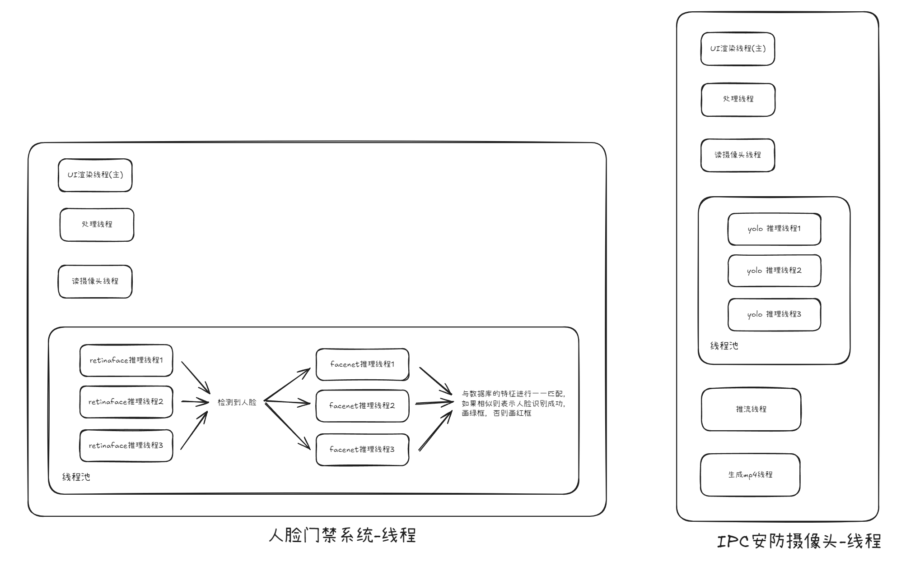

# Deep Learning-Based Face Access Control + IPC Intelligent Security Monitoring System

This project is based on yolo11, retinaface, and facenet deep learning models, with LVGL as the GUI, implementing an IPC intelligent security monitoring system with face detection, face recognition, and object detection capabilities, running at full frame rate.

## Prerequisites

### Clone the project

```sh
git clone https://github.com/qaz624824554/deep_learning_security_system.git
cd deep_learning_security_system
```

LVGL is a submodule of this project, use the following command to get it, it will be downloaded to the lvgl/ directory

```sh
git submodule update --init --recursive
```

### Dependencies

This project relies on multiple third-party libraries. Please ensure your development board has the following libraries installed:

- [Opencv4.9](https://github.com/opencv/opencv/tree/4.9.0)
- [RKNN](https://github.com/airockchip/rknn-toolkit2)
- [FFmpeg-rockchip](https://github.com/nyanmisaka/ffmpeg-rockchip)
- [MPP](https://github.com/rockchip-linux/mpp)
- [BlueAlsa](https://github.com/arkq/bluez-alsa)

### Hardware


- Wildfire LubanCat4 RK3588S2
- IMX415 8MP 4K camera
- RTL8822CE Wifi+BT
- mipi LCD RGB 7-inch 1024×600 touchscreen
- Human infrared detection SR501: Reads corresponding values via GPIO to determine if someone is approaching
- 128×32 OLED display: Displays screen content via I2C communication, used to show face detection results
- Bluetooth speaker

## Getting Started

Compile

```sh
cmake -B build .
cmake --build build -j8
```

Run the `lvglsim` file in the `/bin` directory.

## Process Diagram



## Demonstration Video

https://github.com/user-attachments/assets/e493e5e0-1b1d-4ffd-8c75-4e6db3a32b72
